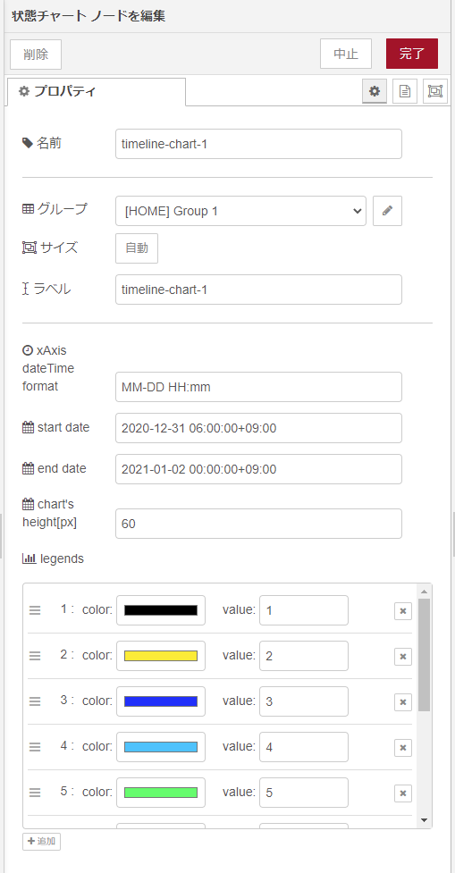

# node-red-contrib-ui-timelines-chart

A Node-RED widget node for showing the chart of status.


## Pre-requisites

The node-red-contrib-ui-timelines-chart requires `Node-RED Dashboard 2.10` to be installed.

## Folder structure

```cmd
root
│
├─data  -> node-RED work folder
│
├─dist  -> Build output folder
│
├─figs
│
├─node_modules
│
├─nodes
│  ├─icons
│
├─src   -> Development folder
│  │
│  ├─locales
│  │  ├─en-US
│  │  └─ja
│  │
│  ├─ type.ts
│  ├─ ui_timelines_chart.html
│  ├─ ui_timelines_chart.ts
│  └─ util.ts
│
├─.gitignore
├─.npmignore
├─build.bat  -> windows only
│
```

## Install

```cmd
npm install node-red-contrib-ui-timelines-chart
```

**Note**: This node uses APIs that require at least Node-RED 0.19 and Node-RED Dashboard 2.10.

## Usage

"ui-timelines-chart" node is a UI widget that can be used to display the chart of status in the Node-RED dashboard.

- Widget properties

  

  - name

    Set for the node name to be displayed in flow.

  - group

    Set for the group to be displayed on the dashboard.

  - size

    Set the size on the dashboard.

  - label

    Set for the name to be displayed on the dashboard.

  - x axis datetime format

    Set for the x-axis datetime format.

    ```cmd
    - YYYY-MM-DD HH:mm:ss
    - YYYY-MM-DD
    - HH:mm:ss
    - HH:mm
    - HH
    ....
    ```

    **ISO 8601 format*

  - start date

    Set for the start time for the X axis.
    If not set, select the first data.

    ```cmd
    2021-01-01T00:00:00Z
    ```

    **ISO 8601 format*

  - end date

    Set for the end time for the X axis.
    If not set, select the last data.

    ```cmd
    2021-01-02T00:00:00Z
    ```

    **ISO 8601 format*

  - chart's height[px]

    Set for the maximum height of each line, in px.

  - legends

      Set the `color` and `value` to be displayed on the chart.

- Input items

    An array of Items is passed in by msg.payload. It consists of objects containing the following properties.

    [Data syntax]

    ```json
    [
        {
            group: "group1name",
            data: [
            {
                label: "label1name",
                data: [
                {
                    timeRange: [<date>, <date>],
                    val: <val: number (continuous dataScale) or string (ordinal dataScale)>
                },
                {
                    timeRange: [<date>, <date>],
                    val: <val>
                },
                (...)
                ]
            },
            {
                label: "label2name",
                data: [...]
            },
            (...)
            ],
        },
        {
            group: "group2name",
            data: [...]
        },
        (...)
    ]
    ```

- Build and install

    You can use this command to build and install.

    ```cmd
    .\build.bat
    ```

    ※windows only.

- Debug

    You can use this command to debug.

    ```cmd
    npm run debug
    ```

    ```cmd
    > node --inspect-brk=0.0.0.0:9229 ./node_modules/node-red/red.js --userDir ./data --settings ./data/settings.js

    Debugger listening on ws://0.0.0.0:9229/{guid}
    For help, see: https://nodejs.org/en/docs/inspector
    ```

    Use VS Code's built-in debugger.
